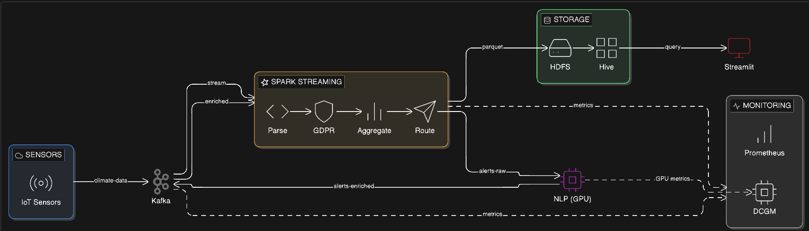

# 🌍 Climate Monitoring & AI Risk Platform

A real-time climate data processing and analysis platform leveraging Big Data technologies, GPU-accelerated NLP, and stream processing to detect and predict climate events from multilingual sensor alerts.

## 📋 Table of Contents

- [Overview](#overview)
- [Architecture](#architecture)
- [Key Features](#key-features)
- [Technology Stack](#technology-stack)
- [Prerequisites](#prerequisites)
- [Installation & Setup](#installation--setup)
  - [1. Java Installation](#1-java-installation)
  - [2. Hadoop Setup](#2-hadoop-setup)
  - [3. Hive Setup](#3-hive-setup)
  - [4. Kafka Setup](#4-kafka-setup)
  - [5. Spark Setup](#5-spark-setup)
  - [6. Python Virtual Environment](#6-python-virtual-environment)
  - [7. Monitoring & Logging](#7-monitoring--logging)
- [Running the Platform](#running-the-platform)
- [Data Flow](#data-flow)
- [API Endpoints](#api-endpoints)
- [Monitoring](#monitoring)
- [Troubleshooting](#troubleshooting)
- [Project Structure](#project-structure)

---

## Overview

This platform simulates and processes climate sensor data from 5,000+ sensors in real-time. It uses Apache Kafka for streaming, Apache Spark for processing, GPU-accelerated NLP for multilingual alert classification, and Apache Hive for data warehousing. A Streamlit dashboard provides real-time visualization of predictions and risk levels.

**Key Capabilities:**
- Real-time processing of 5,000 climate sensors
- Multilingual alert detection (English, Hindi, French, Spanish)
- GPU-accelerated zero-shot classification for event prediction
- GDPR-compliant data anonymization
- Real-time risk assessment (HIGH/MEDIUM/LOW)
- Interactive monitoring dashboard with Hive integration
- Complete observability with Prometheus & Grafana

---


---

## Key Features

### 🌡️ Data Generation & Simulation
- **5,000+ Virtual Sensors** generating realistic climate data
- **Diurnal Temperature Patterns** using sinusoidal modeling
- **Anomaly Injection** (1% probability for extreme events)
- **Device Failure Simulation** (2% failure rate)
- **GDPR Compliance** with SHA-256 sensor ID hashing

### 🌐 Multilingual Alert Processing
- Supports 5 languages: English, Hindi, French, Spanish, Tamil (via Unicode)
- GPU-accelerated **mDeBERTa-v3** model for zero-shot classification
- Batch processing (32 alerts/batch) for optimal GPU utilization
- Real-time translation to event categories

### 🔥 AI-Powered Event Classification
- **Event Types:** Heatwave, Cyclone, Flood, Storm, Normal Weather
- **Risk Assessment:** HIGH / MEDIUM / LOW
- **Confidence Scoring** for each prediction
- **Zero-shot learning** - no fine-tuning required

### 📊 Stream Processing
- **5-minute tumbling windows** for aggregations
- **2-minute watermarking** for late data handling
- **Exactly-once semantics** with Kafka checkpoints
- **Automatic backpressure handling**

### 📈 Real-Time Dashboard
- Live metrics refreshing every 5 seconds
- Risk level filtering and confidence thresholding
- Temperature & confidence trend visualization
- Event distribution analytics
- Top 20 multilingual alerts display

---

## Technology Stack

| Component | Technology | Version |
|-----------|-----------|---------|
| **Data Generation** | FastAPI + Faker | 0.109+ |
| **Message Queue** | Apache Kafka (KRaft) | 3.6.1 |
| **Stream Processing** | Apache Spark (PySpark) | 3.5.1 |
| **Storage Layer** | HDFS (Hadoop) | 3.3.6 |
| **Data Warehouse** | Apache Hive | 3.1.3+ |
| **NLP Model** | mDeBERTa-v3-base-mnli-xnli | Latest |
| **ML Framework** | PyTorch + Transformers | 2.0+ |
| **Dashboard** | Streamlit | 1.30+ |
| **Monitoring** | Prometheus + Grafana | 3.10 / Latest |
| **Containerization** | Docker Compose / Podman | - |
| **GPU Runtime** | CUDA 12.3 + nvidia-container-toolkit | - |

---

## Prerequisites

### Hardware Requirements
- **CPU:** 8+ cores recommended
- **RAM:** 16GB minimum, 32GB recommended
- **GPU:** NVIDIA GPU with 8GB+ VRAM (for NLP service)
- **Storage:** 50GB+ free space

### Software Requirements
- **OS:** Linux (tested on Fedora/RHEL/Ubuntu)
- **Java:** OpenJDK 8
- **Python:** 3.8+
- **CUDA:** 12.0+ (for GPU acceleration)
- **Docker/Podman:** Latest version
- **Network:** Ports 8501, 9000, 9092, 9100, 9400, 9308, 10000 available

---

## Installation & Setup

### 1. Java Installation

```bash
# Install OpenJDK 8
sudo dnf install java-8-openjdk -y

# Verify installation
java -version
```

**Set JAVA_HOME:**
```bash
nano ~/.bashrc

# Add this line:
export JAVA_HOME=/usr/lib/jvm/java-8-openjdk

source ~/.bashrc
```

---

### 2. Hadoop Setup

**Download and Extract:**
```bash
cd ~
wget https://archive.apache.org/dist/hadoop/common/hadoop-3.3.6/hadoop-3.3.6.tar.gz
tar -xzf hadoop-3.3.6.tar.gz
mv hadoop-3.3.6 hadoop
```

**Configure Environment Variables:**
```bash
nano ~/.bashrc

# Add these lines:
export HADOOP_HOME=~/hadoop
export HADOOP_CONF_DIR=$HADOOP_HOME/etc/hadoop
export PATH=$PATH:$HADOOP_HOME/bin:$HADOOP_HOME/sbin

source ~/.bashrc
```

**Configure Hadoop Files:**

**1. core-site.xml:**
```bash
nano ~/hadoop/etc/hadoop/core-site.xml
```

```xml
<configuration>
    <property>
        <name>fs.defaultFS</name>
        <value>hdfs://localhost:9000</value>
    </property>
</configuration>
```

**2. hdfs-site.xml:**
```bash
nano ~/hadoop/etc/hadoop/hdfs-site.xml
```

```xml
<configuration>
    <property>
        <name>dfs.replication</name>
        <value>1</value>
    </property>
    <property>
        <name>dfs.namenode.name.dir</name>
        <value>file:///home/rrp/hadoopdata/namenode</value>
    </property>
    <property>
        <name>dfs.datanode.data.dir</name>
        <value>file:///home/rrp/hadoopdata/datanode</value>
    </property>
</configuration>
```

**3. mapred-site.xml:**
```bash
nano ~/hadoop/etc/hadoop/mapred-site.xml
```

```xml
<configuration>
    <property>
        <name>mapreduce.framework.name</name>
        <value>yarn</value>
    </property>
</configuration>
```

**4. yarn-site.xml:**
```bash
nano ~/hadoop/etc/hadoop/yarn-site.xml
```

```xml
<configuration>
    <property>
        <name>yarn.nodemanager.aux-services</name>
        <value>mapreduce_shuffle</value>
    </property>
</configuration>
```

**Create Directories and Format:**
```bash
mkdir -p ~/hadoopdata/namenode
mkdir -p ~/hadoopdata/datanode

hdfs namenode -format
```

**Start Hadoop Services:**
```bash
start-dfs.sh
start-yarn.sh

# Verify services are running
jps
```

**Expected Output:**
```
NameNode
DataNode
SecondaryNameNode
ResourceManager
NodeManager
```

---

### 3. Hive Setup

**Install and Configure Hive:**
```bash
# Start Hive CLI
hive
```

**Create External Table:**
```sql
CREATE EXTERNAL TABLE climate_predictions (
    sensor_id_hash STRING,
    timestamp STRING,
    temperature DOUBLE,
    humidity DOUBLE,
    wind_speed DOUBLE,
    alert STRING,
    predicted_event STRING,
    risk_level STRING,
    confidence DOUBLE
)
STORED AS PARQUET
LOCATION '/climate-predictions';
```

**Verify Table:**
```sql
SELECT * FROM climate_predictions LIMIT 10;
```

**Configure HiveServer2 (NOSASL Mode):**
```bash
nano $HIVE_HOME/conf/hive-site.xml
```

```xml
<?xml version="1.0" encoding="UTF-8"?>
<configuration>

  <!-- MySQL Metastore -->
  <property>
    <name>javax.jdo.option.ConnectionURL</name>
    <value>jdbc:mysql://localhost/metastore?createDatabaseIfNotExist=true</value>
  </property>

  <property>
    <name>javax.jdo.option.ConnectionDriverName</name>
    <value>com.mysql.cj.jdbc.Driver</value>
  </property>

  <property>
    <name>javax.jdo.option.ConnectionUserName</name>
    <value>hiveuser</value>
  </property>

  <property>
    <name>javax.jdo.option.ConnectionPassword</name>
    <value>hivepassword</value>
  </property>

  <property>
    <name>datanucleus.autoCreateSchema</name>
    <value>true</value>
  </property>

  <property>
    <name>hive.server2.enable.doAs</name>
    <value>false</value>
  </property>

  <!-- Binary Mode Configuration -->
  <property>
    <name>hive.server2.transport.mode</name>
    <value>binary</value>
  </property>

  <property>
    <name>hive.server2.thrift.port</name>
    <value>10000</value>
  </property>

  <property>
    <name>hive.server2.authentication</name>
    <value>NOSASL</value>
  </property>

</configuration>
```

**Start HiveServer2:**
```bash
hiveserver2 &
```

**Install Python Dependencies:**
```bash
pip install pyhive thrift thrift-sasl sasl
```

---

### 4. Kafka Setup

**Download and Extract:**
```bash
cd ~/climate_platform/kafka
wget https://archive.apache.org/dist/kafka/3.6.1/kafka_2.13-3.6.1.tgz
tar -xzf kafka_2.13-3.6.1.tgz
mv kafka_2.13-3.6.1 kafka
cd kafka
```

**Configure KRaft Mode:**

Edit `config/kraft/server.properties`:
```bash
nano config/kraft/server.properties
```

Add/modify these lines:
```properties
listeners=PLAINTEXT://0.0.0.0:9092
advertised.listeners=PLAINTEXT://host.containers.internal:9092
```

**Generate UUID and Format:**
```bash
# Generate cluster UUID
bin/kafka-storage.sh random-uuid
# Example output: CpoDCh9tRfSwnHfNGBNVKg

# Format storage using the UUID
bin/kafka-storage.sh format -t CpoDCh9tRfSwnHfNGBNVKg -c config/kraft/server.properties
```

**Start Kafka:**
```bash
bin/kafka-server-start.sh config/kraft/server.properties
```

**Create Topics:**
```bash
# Open new terminal
cd ~/climate_platform/kafka/kafka

# Create climate-data topic
bin/kafka-topics.sh --create \
  --topic climate-data \
  --bootstrap-server localhost:9092 \
  --partitions 3 \
  --replication-factor 1

# Create alerts-raw topic
bin/kafka-topics.sh --create \
  --topic alerts-raw \
  --bootstrap-server localhost:9092 \
  --partitions 3 \
  --replication-factor 1

# Create alerts-enriched topic
bin/kafka-topics.sh --create \
  --topic alerts-enriched \
  --bootstrap-server localhost:9092 \
  --partitions 3 \
  --replication-factor 1

# List all topics
bin/kafka-topics.sh --list --bootstrap-server localhost:9092
```

**Test Kafka (Optional):**
```bash
# Terminal 1 - Consumer
bin/kafka-console-consumer.sh \
  --topic climate-data \
  --bootstrap-server localhost:9092

# Terminal 2 - Producer
bin/kafka-console-producer.sh \
  --topic climate-data \
  --bootstrap-server localhost:9092
```

---

### 5. Spark Setup

**Download and Extract:**
```bash
cd ~/climate_platform/spark
wget https://archive.apache.org/dist/spark/spark-3.5.1/spark-3.5.1-bin-hadoop3.tgz
tar -xzf spark-3.5.1-bin-hadoop3.tgz
mv spark-3.5.1-bin-hadoop3 spark
```

**Test Spark Installation:**
```bash
cd spark
bin/spark-shell --version
```

---

### 6. Python Virtual Environment

**Create and Activate Virtual Environment:**
```bash
cd ~/climate_platform
python3 -m venv cli_venv
source cli_venv/bin/activate
```

**Install Dependencies:**
```bash
# Core dependencies
pip install fastapi uvicorn kafka-python faker pyspark

# NLP Service dependencies
pip install transformers torch

# Dashboard dependencies
pip install streamlit pandas pyhive thrift thrift-sasl sasl
```

---

### 7. Monitoring & Logging

#### Node Exporter Setup

```bash
# Download and extract
wget https://github.com/prometheus/node_exporter/releases/latest/download/node_exporter-1.10.2.linux-amd64.tar.gz
tar -xvf node_exporter-1.10.2.linux-amd64.tar.gz
cd node_exporter-1.10.2.linux-amd64

# Run Node Exporter
./node_exporter

# Verify (in browser)
# http://localhost:9100/metrics
```

#### Prometheus Setup

```bash
# Download and extract
wget https://github.com/prometheus/prometheus/releases/download/v3.10.0/prometheus-3.10.0.linux-amd64.tar.gz
tar -xvf prometheus-3.10.0.linux-amd64.tar.gz
cd prometheus-3.10.0.linux-amd64

# Configure Prometheus
nano prometheus.yml
```

**prometheus.yml:**
```yaml
global:
  scrape_interval: 5s

scrape_configs:
  - job_name: "node_exporter"
    static_configs:
      - targets: ["localhost:9100"]

  - job_name: "gpu"
    static_configs:
      - targets: ["localhost:9400"]

  - job_name: "kafka"
    static_configs:
      - targets: ["localhost:9308"]
```

**Start Prometheus:**
```bash
./prometheus --config.file=prometheus.yml
```

#### Grafana Setup

```bash
# Install Grafana
sudo dnf install grafana -y

# Enable and start service
sudo systemctl daemon-reload
sudo systemctl enable grafana-server
sudo systemctl start grafana-server
```

**Access Grafana:**
- URL: http://localhost:3000
- Default credentials: `admin` / `admin`

**Add Prometheus Data Source:**
1. Configuration → Data Sources → Add data source
2. Select Prometheus
3. URL: http://localhost:9090
4. Save & Test

**Import Dashboards:**
- Node Exporter: Dashboard ID **1860**
- GPU Metrics: Dashboard ID **12239**

#### GPU Monitoring (NVIDIA)

**Setup NVIDIA Container Toolkit:**
```bash
sudo dnf install nvidia-container-toolkit -y
sudo nvidia-ctk cdi generate --output=/etc/cdi/nvidia.yaml
```

**Test GPU Access:**
```bash
podman run --rm --security-opt=label=disable \
  --hooks-dir=/usr/share/containers/oci/hooks.d/ \
  docker.io/nvidia/cuda:12.3.0-base-ubuntu22.04 nvidia-smi
```

**Run DCGM Exporter:**
```bash
podman pull docker.io/nvidia/dcgm-exporter:latest

podman run -d \
  --name dcgm-exporter \
  --security-opt=label=disable \
  --device nvidia.com/gpu=all \
  -p 9400:9400 \
  docker.io/nvidia/dcgm-exporter:latest
```

**Verify GPU Metrics:**
```bash
curl http://localhost:9400/metrics
```

#### Kafka Metrics Exporter

```bash
podman pull docker.io/danielqsj/kafka-exporter

podman run -d \
  --name kafka-exporter \
  -p 9308:9308 \
  docker.io/danielqsj/kafka-exporter \
  --kafka.server=host.containers.internal:9092
```

**Verify Kafka Metrics:**
```bash
curl http://localhost:9308/metrics
```

**Restart Monitoring Services:**
```bash
podman start dcgm-exporter
podman start kafka-exporter
```

---

## Running the Platform

### Step-by-Step Startup Sequence

**1. Start Hadoop (if not running):**
```bash
start-dfs.sh
start-yarn.sh
jps  # Verify
```

**2. Start Kafka:**
```bash
cd ~/climate_platform/kafka/kafka
bin/kafka-server-start.sh config/kraft/server.properties
```

**3. Start HiveServer2 (if not running):**
```bash
hiveserver2 &
```

**4. Start Mock Weather API:**
```bash
cd ~/climate_platform/mock_weather_api
source ~/climate_platform/cli_venv/bin/activate
uvicorn app:app --port 9002 --reload
```

**5. Start Spark Streaming Job:**
```bash
cd ~/climate_platform/spark/spark
source ~/climate_platform/cli_venv/bin/activate
bin/spark-submit \
  --packages org.apache.spark:spark-sql-kafka-0-10_2.12:3.5.1 \
  ../climate_stream.py
```

**6. Start NLP Service (GPU):**
```bash
# Option A: Direct Python execution
cd ~/climate_platform/nlp-service
source ~/climate_platform/nlp_venv/bin/activate
python nlp_consumer.py

# Option B: FastAPI service
uvicorn app:app --port 9001
```

**7. Start Dashboard:**
```bash
cd ~/climate_platform/dashboard
source ~/climate_platform/cli_venv/bin/activate
streamlit run dashboard.py
```

**8. Start Monitoring (Optional):**
```bash
# Terminal 1 - Prometheus
cd ~/prometheus-3.10.0.linux-amd64
./prometheus --config.file=prometheus.yml

# Terminal 2 - Grafana (already running as service)
sudo systemctl status grafana-server

# Terminal 3 - GPU Exporter
podman start dcgm-exporter

# Terminal 4 - Kafka Exporter
podman start kafka-exporter
```

### Access URLs

| Service | URL | Purpose |
|---------|-----|---------|
| **Dashboard** | http://localhost:8501 | Main monitoring UI |
| **Mock API Health** | http://localhost:9002/health | API status check |
| **NLP Service** | http://localhost:9001/analyze_batch | NLP predictions |
| **Grafana** | http://localhost:3000 | System metrics |
| **Prometheus** | http://localhost:9090 | Metrics scraper |
| **Node Exporter** | http://localhost:9100/metrics | System metrics |
| **GPU Metrics** | http://localhost:9400/metrics | NVIDIA GPU stats |
| **Kafka Metrics** | http://localhost:9308/metrics | Kafka stats |

---

## Data Flow

### Complete Pipeline

```
1️⃣ GENERATION
   Mock Weather API generates 5,000 sensor readings every 2 seconds
   ↓
   - Temperature (28°C ± diurnal variation)
   - Humidity (35-90%)
   - Wind Speed (0-40 km/h)
   - Multilingual alerts (5% probability)
   - Anomalies injected (1% probability)

2️⃣ INGESTION
   Kafka Producer sends JSON to 'climate-data' topic
   ↓
   - Batch size: 16KB
   - Linger: 10ms
   - Partitions: 3

3️⃣ STREAM PROCESSING (Spark)
   Spark reads from Kafka with structured streaming
   ↓
   - Parse JSON schema
   - SHA-256 anonymization (GDPR compliance)
   - 5-minute window aggregations
   - Filter alerts (where alert IS NOT NULL)
   - Write aggregates to HDFS (Parquet)
   - Send alerts to 'alerts-raw' topic

4️⃣ NLP ENRICHMENT
   NLP Consumer processes alerts in batches of 32
   ↓
   - GPU-accelerated mDeBERTa-v3 inference
   - Zero-shot classification (5 event types)
   - Risk level assignment
   - Confidence scoring
   - Send to 'alerts-enriched' topic

5️⃣ STORAGE
   Spark reads enriched alerts from Kafka
   ↓
   - Write to HDFS: /climate-predictions (Parquet)
   - Hive external table automatically picks up new data

6️⃣ VISUALIZATION
   Streamlit dashboard queries Hive via PyHive
   ↓
   - Real-time metrics
   - Risk filtering
   - Confidence thresholds
   - Interactive charts
   - Auto-refresh (5 sec)
```

### Kafka Topics

| Topic | Producer | Consumer | Purpose |
|-------|----------|----------|---------|
| `climate-data` | Mock API | Spark Stream | Raw sensor readings |
| `alerts-raw` | Spark Stream | NLP Service | Filtered alerts for NLP |
| `alerts-enriched` | NLP Service | Spark Stream | Classified alerts |

### HDFS Directories

| Path | Format | Description |
|------|--------|-------------|
| `/climate-aggregates` | Parquet | 5-min windowed aggregations |
| `/climate-predictions` | Parquet | Final enriched predictions |
| `/climate-aggregates-checkpoint` | Internal | Spark checkpoint for aggregates |
| `/alerts-raw-checkpoint` | Internal | Spark checkpoint for alerts |
| `/climate-predictions-checkpoint` | Internal | Spark checkpoint for predictions |

---

## API Endpoints

### Mock Weather API

**GET `/health`**
```bash
curl http://localhost:9002/health
```

Response:
```json
{
  "status": "running"
}
```

### NLP Service

**POST `/analyze_batch`**
```bash
curl -X POST http://localhost:9001/analyze_batch \
  -H "Content-Type: application/json" \
  -d '{
    "alerts": [
      "Heatwave warning",
      "चक्रवात चेतावनी",
      "Cyclone Alert"
    ]
  }'
```

Response:
```json
{
  "results": [
    {
      "alert": "Heatwave warning",
      "predicted_event": "heatwave",
      "risk_level": "MEDIUM",
      "confidence": 0.892
    },
    {
      "alert": "चक्रवात चेतावनी",
      "predicted_event": "cyclone",
      "risk_level": "HIGH",
      "confidence": 0.945
    },
    {
      "alert": "Cyclone Alert",
      "predicted_event": "cyclone",
      "risk_level": "HIGH",
      "confidence": 0.978
    }
  ]
}
```

---

## Monitoring

### Key Metrics to Watch

**System Metrics (Node Exporter)**
- CPU usage per core
- Memory utilization
- Disk I/O
- Network throughput

**GPU Metrics (DCGM Exporter)**
- GPU utilization (%)
- GPU memory usage (MB)
- GPU temperature (°C)
- Power consumption (W)
- SM clock frequency

**Kafka Metrics (Kafka Exporter)**
- Consumer lag per topic
- Messages in/out per second
- Broker status
- Partition count
- Under-replicated partitions

**Application Metrics**
- Spark streaming batch processing time
- NLP inference latency
- Records processed per minute
- Hive query response time

### Grafana Dashboard IDs

- **Node Exporter Full**: 1860
- **NVIDIA DCGM Exporter**: 12239

---

## Troubleshooting

### Common Issues

**1. Kafka Connection Refused**
```bash
# Check if Kafka is running
ps aux | grep kafka

# Check if port is listening
netstat -tuln | grep 9092

# Restart Kafka
cd ~/climate_platform/kafka/kafka
bin/kafka-server-start.sh config/kraft/server.properties
```

**2. Spark Cannot Connect to Kafka**
```bash
# Verify Kafka topics exist
cd ~/climate_platform/kafka/kafka
bin/kafka-topics.sh --list --bootstrap-server localhost:9092

# Check Spark logs
# Look for connection errors in Spark terminal
```

**3. HDFS NameNode Not Starting**
```bash
# Check HDFS logs
cat ~/hadoop/logs/hadoop-*-namenode-*.log

# Reformat NameNode (WARNING: Deletes all data)
hdfs namenode -format

# Restart HDFS
stop-dfs.sh
start-dfs.sh
```

**4. HiveServer2 Connection Issues**
```bash
# Check if HiveServer2 is running
ps aux | grep hiveserver2

# Check port 10000
netstat -tuln | grep 10000

# Restart HiveServer2
pkill -f hiveserver2
hiveserver2 &
```

**5. GPU Out of Memory**
```bash
# Check GPU memory
nvidia-smi

# Kill processes using GPU
nvidia-smi | grep python
kill -9 <PID>

# Reduce batch size in nlp_consumer.py
# Change batch size from 32 to 16
```

**6. Dashboard Shows No Data**
```bash
# Check Hive table has data
hive -e "SELECT COUNT(*) FROM climate_predictions;"

# Verify HDFS has Parquet files
hdfs dfs -ls /climate-predictions

# Check Spark streaming is writing data
# Look for "Batch: X" messages in Spark terminal
```

**7. Virtual Environment Issues**
```bash
# Recreate virtual environment
rm -rf ~/climate_platform/cli_venv
python3 -m venv ~/climate_platform/cli_venv
source ~/climate_platform/cli_venv/bin/activate
pip install fastapi uvicorn kafka-python faker pyspark streamlit pandas pyhive
```

### Verification Commands

**Check All Services:**
```bash
# Hadoop
jps

# Kafka
ps aux | grep kafka

# HiveServer2
ps aux | grep hiveserver2

# Python Services
ps aux | grep python
```

**Check Ports:**
```bash
netstat -tuln | grep -E '8501|9000|9092|9001|9002|10000'
```

**Check Logs:**
```bash
# Hadoop NameNode
tail -f ~/hadoop/logs/hadoop-*-namenode-*.log

# Kafka
tail -f ~/climate_platform/kafka/kafka/logs/server.log

# Application logs (in respective terminals)
```

---

## Project Structure

```
climate_platform/
│
├── cli_venv/                       # Python virtual environment
│   ├── bin/                        # Executables (python, pip, spark, etc.)
│   ├── lib/                        # Python packages
│   └── share/                      # Shared resources
│
├── dashboard/                      # Streamlit Dashboard Service
│   ├── dashboard.py                # Main dashboard application
│   ├── requirements.txt            # Dashboard dependencies
│   └── dockerfile                  # Docker build file
│
├── kafka/                          # Apache Kafka
│   ├── kafka_installation_testing_guide.txt
│   └── kafka/                      # Kafka 3.6.1 installation
│       ├── bin/                    # Kafka scripts
│       ├── config/                 # Configuration files
│       └── logs/                   # Kafka logs
│
├── mock_weather_api/               # Data Generation Service
│   ├── app.py                      # FastAPI application
│   ├── kafka_producer.py           # Kafka producer logic
│   └── mock_engine.py              # Climate data simulator
│
├── nlp-service/                    # NLP Processing Service
│   ├── app.py                      # FastAPI NLP endpoint
│   ├── nlp_consumer.py             # Kafka consumer for NLP
│   ├── requirements.txt            # NLP dependencies
│   ├── dockerfile                  # Docker build file
│   └── nlp_venv/                   # NLP virtual environment
│
├── spark/                          # Apache Spark
│   ├── climate_stream.py           # PySpark streaming job
│   ├── spark_setup_guide.txt       # Installation guide
│   ├── dockerfile                  # Docker build file
│   └── spark/                      # Spark 3.5.1 installation
│       ├── bin/                    # Spark scripts
│       ├── conf/                   # Configuration
│       └── jars/                   # Spark JARs
│
├── docker-compose.yml              # Container orchestration
├── hadoop_installation_and_setup.md # Hadoop setup guide
├── hive_setup.md                   # Hive setup guide
├── monitoring_and_logging_metric_setup.md # Monitoring guide
└── README.md                       # This file
```

---

## License

This project is for educational and demonstration purposes.

---

## Contributors

Developed as a comprehensive Big Data & AI platform demonstration.

---

## Support

For issues and questions:
1. Check the [Troubleshooting](#troubleshooting) section
2. Verify all services are running with verification commands
3. Check service logs for specific error messages
4. Ensure all prerequisites are installed correctly

---

**Last Updated:** March 2026  
**Platform Version:** 1.0.0  
**Tested On:** Fedora Linux, RHEL, Ubuntu 22.04
